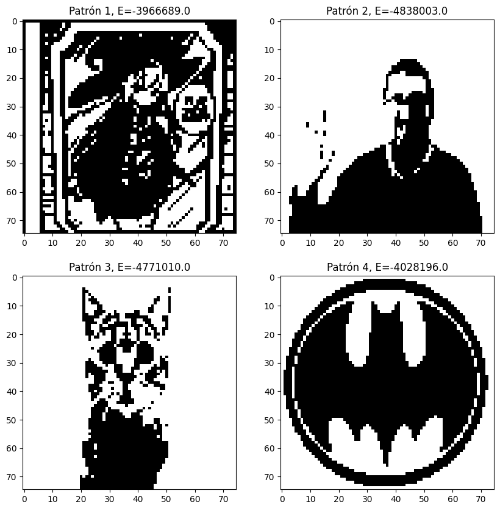
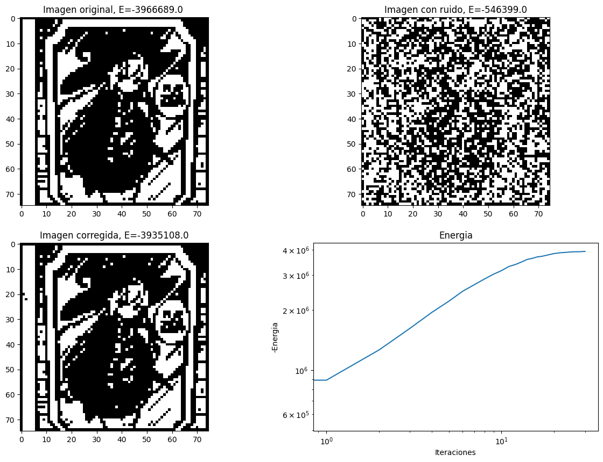
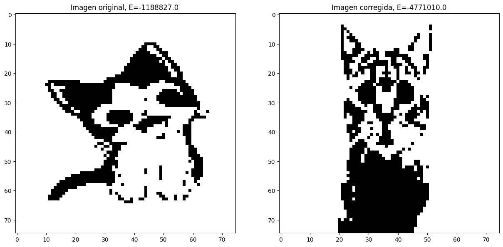
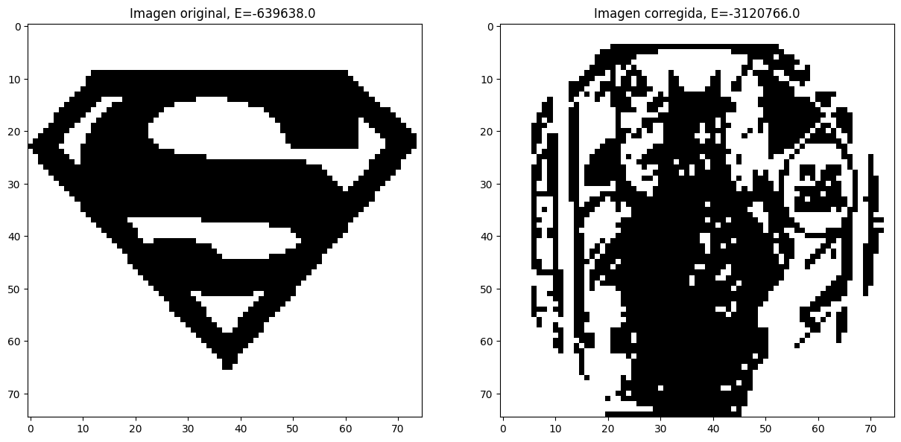
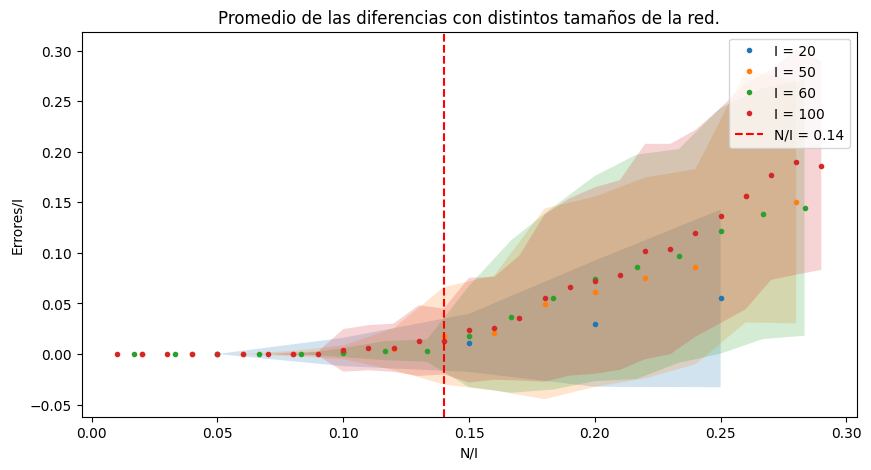

# Optimización en Sistemas Físicos

# y Aplicaciones Industriales

###### Maśter Universitario en Tecnología Física: Investigación y Aplicaciones

Curso 2023-2024

# Portfolio de actividades guiadas

###### Francisco Manuel Olmedo Cortés

 
 

Nota: Todos los códigos que aparecen aquí se encuentra en este repositorio: 

[Optimization-Algorithms](https://github.com/FullFran/Optimization-Algorithms/tree/main)

---

# TEMA 1: Introducción a los problemas de optimización

## ***Resumen y objetivos:***

En esta actividad vamos a resolver el problema del viajante (TSP) con un método exacto y uno aproximado. Comparándolos entre sí. En concreto:

- Fijando el número de ciudades N y sus posiciones (generadas aleatoriamente), analizaremos todos los caminos posibles que empiezan y acaban en la misma ciudad (permutaciones), buscando aquel de mínimo recorrido. Este será nuestro método exacto.
- Con las mismas ciudades, buscaremos una solución aproximada, partiendo de una ciudad y saltando siempre a la más cercana (esto lo haremos para cada ciudad). Este es el método del vecino más cercano.
- Finalmente representaremos las posiciones de las ciudades y los caminos seguidos en el plano.
- Calculamos el tiempo invertido en calcular la solución con cada método y representaremos esto en función de N.

## Resultados:

- Comparación de resultados obtenidos:

En estas imágenes podemos ver la diferencia entre el camino obtenido con el método aproximado y el exacto. Se puede observar como el resultado obtenido por el método aproximado no tiene por qué dar la solución óptima para el problema.

- Comparación de tiempos de ejecución en función del número de ciudades.

En la gráfica podemos ver la comparación del tiempo de ejecución en función el número de ciudades para el algoritmo exacto y el aproximado, como podemos observar, el orden de complejidad del algoritmo aproximado es mucho menos que la del algoritmo exacto. Además podemos ver como el algoritmo aproximado escala de forma polinómica ($O(n^2$)) y el exacto escala peor ($O(n!)$).

## Discusión:

-   Observamos que para Ns muy pequeños, el algoritmo exacto es más
    rápido, pero este se vuelve extremadamente lento para Ns grandes,
    comparado con el otro.
-   El algoritmo exacto se vuelve inviable para N\>10. Sin embargo,
    podemos usar el algoritmo aproximado para Ns mucho más grandes.

## Anexo(s):

Enumerar aquí los códigos usados:

-   [tsp.py](https://github.com/FullFran/Optimization-Algorithms/blob/main/1%20Introducción%20TSP/tsp.py) (Aquí están las funciones utilizadas para la implementación de la lógica del método exacto y el método aproximado).
- [resultados.ipynb](https://github.com/FullFran/Optimization-Algorithms/blob/main/1%20Introducción%20TSP/resultados.ipynb) (Aquí calculamos los tiempos de ejecución para el método exacto y el método del vecino más cercano y los comparamos, además graficamos la solución para el problema generando ciudades de forma aleatoria).

---

# Tema 2: Fundamentos físico-matemáticos de los algoritmos de optimización.

## Generadores de números aleatorios.

### Resumen y Objetivos:
En esta actividad vamos a implementar varios métodos para la generación de números aleatorios y compararlos entre ellos. En concreto:
- Implementar un generador congruencial lineal y uno de fibonacci. Comparando histogramas entre ellos generando $10^6$ números y la relación del siguiente número en función del anterior para los distintos generadores.
- Implementar métodos para generar números aleatorios distribuidos conforme a una distribución dada por el método de la transformada inversa y el método de aceptación rechazo.

### Resultados:
Nota: En el archivo ejercicios.ipynb se encuentran los ejercicios planteados en las diapositivas resueltos.

- Histogramas de los números generados.
  

Podemos ver como el generador de fibonacci genera números de forma más uniforme que el congruencial lineal, el cual con los primeros parámetros es el que tiene menor uniformidad. Por otro lado, el de numpy es muy uniforme.

- Relación del siguiente número con el anterior.

Podemos ver como el generador lineal congruencial con los primeros parámetros abarca poco espacio por lo que es 'menos aleatorio' mientras que el de fibonnaci abarca más espacio y el de numpy rellena casi todo el espacio.

- Método de la transformada inversa:

Podemos observar como los números se distribullen de forma exponencial.

- Método de aceptación rechazo:

Podemos observar como los números se distribullen según las distribuciones dadas.

### Discusión:
- Podemos observar como el generador de números aleatorios de numpy los genera números aleatorios de una forma muy uniforme, por otro lado, el generador de fibonacci es el que mejor se desempeña de los que hemos desarrollado, mientras tanto, el generador lineal congruencial, los genera de forma menos uniforme y además es muy sensible a los parámentros utilizados.
- En la imagen donde hemos representado la relación del siguiente número con el anterior, hemos ordenado de "mejor" a "peor" generador para ver como "cubren más huecos" es decir, en los mejores generadores desde cada número se puede acceder a más números.
- El método de la transformada inversa es sencillo y más eficiente, pero requiere poder operar de forma analítica la función, lo cual puede no ser viable mientras que el método de aceptación rechazo, aunque es menos ineficiente (ya que tenemos que generar más números aleatorios para conseguir los que buscamos) se puede realizar con cualquier distribución.

### Anexo:
- [generadoresAleatorios.py](https://github.com/FullFran/Optimization-Algorithms/tree/main/2%20Números%20aleatorios%2C%20Métodos%20de%20Montecarlo/Generación%20de%20números%20Aleatorios/generadoresAleatorios.py) (Aquí se implementa la lógica de los generadores de números aleatorios).
- [ejercicios.ipynb](https://github.com/FullFran/Optimization-Algorithms/blob/main/2%20Números%20aleatorios%2C%20Métodos%20de%20Montecarlo/Generación%20de%20números%20Aleatorios/ejercicios.ipynb) (Aquí se realizan los ejercicios propuestos en la asignatura, comparando los distintos generadores de números aleatorios).

## Aguja de Buffon:

### Resumen y Objetivos:
En esta actividad realizaremos el experimento de la aguja de Buffon, comprobando el orden de convergencia de los métodos de montecarlo. En concreto:
- Implementar un código para estimar el valor de $\pi$ empleando el método de la aguja de Buffon.
- Estudiar la convergencia, determinando que converge con un orden de $\frac{1}{\sqrt N}$.
- Comparar la convergencia para distintos tamaños de la aguja.
### Resultados:
- Estimación de pi con el método de Buffon. 

Podemos observar como a mayor número de iteraciones, el resultado oscila menos, convergiendo al valor de pi dado por numpy (linea naranja)

- Error en la convergencia en función del número de tiradas y la longitud de la aguja:

Se pude observar como al aumentar el tamaño de la aguja (d) el erro disminuye, esto concuerda con lo visto teóricamente. Además se ve como el orden de convergencia se ajusta a $N^{-1/2}$.

- Se realizó un ajuste lineal del error representado en doble logarítmico para estimar el orden de convergencia, para suavizar los resultados se realizó la media del orden de convergencia estimado para varias simulaciones obteniendo un resultado de 
 $$co=-0.501\pm0.01$$   

- Al realizar el experimento tirando una aguja nueva en cada iteración manteniendo las anteriores, el orden de convergencia es distinto:

- Realizando una regresión al igual que en el caso anterior obtenemos un resultado de:

$$co = -1.64\pm0.04$$

### Discusión:
- En la imagen de la convergencia del error, vemos como hay que "tirar del orden de 10000 agujas" para obtener una precisión de unos 2-3 decimales en la estimación de $\pi$. 
- Haciendo un ajuste, hemos demostrado que el error converge con $N^\frac{-1}{2}$, como vimos en la teoría para los métodos de Monte Carlo.
- También podemos ver como al aumentar el tamaño de la aguja, se reduce el error como vimos en la teoría.
- Una cosa curiosa que no sucedió fue que al realizar el experimento generando cada vez una aguja nueva en vez de generar n agujas nuevas en cada iteración, el orden de convergencia nos salía distinto de lo esperado como vemos en la imagen. 
## Anexo:
- [buffon_needle.py](https://github.com/FullFran/Optimization-Algorithms/blob/main/2%20Números%20aleatorios%2C%20Métodos%20de%20Montecarlo/Aguja%20de%20Buffon/buffon_needle.py)  (Aquí implementamos la lógica para la simulación del problema).
- [buffon_needle.ipynb](https://github.com/FullFran/Optimization-Algorithms/blob/main/2%20Números%20aleatorios%2C%20Métodos%20de%20Montecarlo/Aguja%20de%20Buffon/buffon_needle.ipynb) (Aquí ejecutamos el código, calculamos los tiempos de ejecución y hacemos el ajuste).

---
# Tema 3: Algoritmos para la optimización en espacios de alta dimensionalidad.

## Resumen y Objetivos:
En esta actividad resolveremos el TSP mediante simulated annealing y un algoritmo genético. En concreto:
- Implementaremos los métodos de simulated annealing y algoritmo genético para resolver el TSP.
- Resolveremos el TSP para distintos números de ciudades con ambos métodos, mostrando la evolución de la distancia de la ruta.

## Resultados:

- Resultados obtenidos por el simulated annealing con 30 ciudades:

Resultado obtenido para 30 ciudades en 2.4s.

- Resultados obtenidos por el simulated annealing con 90 ciudades:

Resultado obtenido para 90 ciudades en 3.5s.

- Resultados obtenidos por el algoritmo genético con 30 ciudades:

Resultado obtenido para 30 ciudades en 10.2s.

- Resultados obtenidos por el algoritmo genético con 90 ciudades:

Resultado obtenido para 90 ciudades en 31.6s.

## Discusión:
- En las gráficas podemos observar como tanto el simulated annealing como el algoritmo genético se desempeñan bien a la hora de resolver el TSP reduciendo la distancia recorrida con el tiempo hasta aproximarse a la solución exacta.
- En las gráficas del simulated annealing, podemos observar como en las primeras iteraciones, encontrándose a mayores temperaturas, la distancia recorrida no se reduce a penas, pero el algoritmo está explorando más estados, hasta que se alcanza una temperatura crítica (igual que en el [modelo de issing](https://github.com/FullFran/Optimization-Algorithms/tree/main/2%20Números%20aleatorios%2C%20Métodos%20de%20Montecarlo/Trabajo%20Issing/Code)) a la cual el sistema empieza a 'congelarse' y converge a soluciones con menor distancia recorrida. Esto es debido a que al bajar la temperatura, la probabilidad de aceptar peores soluciones disminuye.
- En el algoritmo genético, podemos observar como en cada generación la distancia de la ruta del mejor individuo siempre se reduce o se mantiene, esto es debido a que hemos contemplado Elitismo, haciendo que los mejores individuos pasen directamente a la siguiente generación. Además podemos ver como la distribución del fitness conforme avanzan las generaciones, la mayoría de individuos tienen un mayor fitness (ver usando el método graficRun de la clase GeneticAlgorithm).

## Anexo:
- [simAnnealing.py](https://github.com/FullFran/Optimization-Algorithms/blob/main/3%20Algoritmos%20para%20la%20optimización%20en%20espacios%20de%20alta%20dimensionalidad/simAnnealing.py) (Aquí se implementa la lógica del simulated annealing para resolver el TSP).
- [simAnnealing.ipynb](https://github.com/FullFran/Optimization-Algorithms/blob/main/3%20Algoritmos%20para%20la%20optimización%20en%20espacios%20de%20alta%20dimensionalidad/simAnnealing.ipynb) (Aquí están los resultados obtenidos con el simulated annealing).
- [genetic.py](https://github.com/FullFran/Optimization-Algorithms/blob/main/3%20Algoritmos%20para%20la%20optimización%20en%20espacios%20de%20alta%20dimensionalidad/genetic.py) (Aquí se implementa la lógica del algoritmo genético para resolver el TSP).
- [genetic.ipynb](https://github.com/FullFran/Optimization-Algorithms/blob/main/3%20Algoritmos%20para%20la%20optimización%20en%20espacios%20de%20alta%20dimensionalidad/genetic.ipynb) (Aquí están los resultados obtenidos con el algoritmo genético).

---

# Tema 4: Clasificación de eventos y detección de fallos.

## Resumen y Objetivos:
En esta actividad vamos a implementar una red neuronal artificial de Hopfield. En concreto vamos a:
- Entrenar la red con distintos patrones.
- Ver la evolución de la energía en la dinámica de la red.
- Recuperar las imágenes con las que ha sido entrenada la red, pudiendo observar la memoria asociativa.
- Estudiar el límite de almacenamiento entrenando redes de distintos tamaños con distintos patrones aleatorios e intentar recuperar un patrón desde ese patrón con un error aleatorio introducido.

## Resultados:

- Patrones con los que se ha entrenado a la red con sus correspondientes energías.

- Reconstrucción de una imagen usando la red de hopfield entrenada en los 4 patrones anteriores. Reconstruida a partir de la imagen con ruido. 

Se muestra la evolución de la energía, en negativo para poder representar en doble logarítmico para apreciar mejor la evolución (es decir, aunque veamos que aumenta el número en la gráfica, la energía se está haciendo menor osea más negativa, por lo que se está minimizando la energía de la red, como esperabamos ya que el modelo de hopfield implementado es una variación del algoritmo de metrópolis con T=0).

- Reconstrucción de imagen de un gato previamente entrenado a partir de una imagen de un gato distinto. Poniendo de manifiesto la memoria asociativa al reconstruir un patrón a partir de otro con características similares.

- Atractor espureo, aparentemente combinación de patrones obtenido añadiendo como input una imagen distinta a con las que se entrenó la red.

- Error relativo al tamaño de la red en función del número de patrones entre el tamaño de la red. Podemos ver como se obtiene el resultado visto en teoría para el límite de almacenamiento. (La banda de color representa la dispersión de los resultados).

Podemos observar como el límite de almacenamiento de patrones en la red de Hopfield concuerda con lo visto en teoría ya que a partir de ahí al evolucionar comienza a 'añadir errores' al patrón cuando lo dejamos evolucionar.
Al representar los distintos tamaños, podemos observar como la pendiente de los errores relativos tras el cambio de comportamiento parece crecer con el tamaño de la red.

## Discusión:
- Podemos ver como el modelo de Hopfield evoluciona hacia mínimos de energía en la red. Esto como hemos dicho es debido a que sigue la misma lógica que el algoritmo de Metropolis a temperatura 0. Durante el entrenamiento lo que hacemos al definir la matriz de pesos es definir la energía de nuestro sistema de forma que tenga mínimos en los patrones con los cuales hemos entrenado la red. Así la red evolucionará hacia esos patrones.
- Hemos visto la capacidad del modelo para 'recordar' patrones a partir de patrones que comparten características como hemos visto con el patrón con ruido introducido o el gato distinto al gato con el cual fue entrenado. Además también recupera patrones a partir de 'trozos' de los mismos y más. Pudiendo ver la capacidad de memoria asociativa del modelo.
- También hemos visto Uno de los problemas de este modelo, que es la aparición de patrones estables distintos de los patrones con los cuales entrenamos a la red, como es el caso de los atractores espureos como el mostrado en la imagen.
- Por último, hemos realizado una simulación para comprobar el límite de almacenamiento de patrones del modelo. Realizando varias veces el proceso de entrenar con n patrones aleatorios y recordar uno de ellos añadiendole un error. Con esta simulación hemos visto como este se encuentra entorno al $N=0.14I$ como vimos en teoría.

## Anexo:
- [hopfield.py](https://github.com/FullFran/Optimization-Algorithms/blob/main/4%20Clasificaci%C3%B3n%20de%20eventos%20y%20detecci%C3%B3n%20de%20fallos/hopfiled.py) (Aquí se implementa la lógica del modelo de Hopfield).
- [hopfield.ipynb](https://github.com/FullFran/Optimization-Algorithms/blob/main/4%20Clasificaci%C3%B3n%20de%20eventos%20y%20detecci%C3%B3n%20de%20fallos/hopfield.ipynb) (Aquí se entrena la red de Hopfield con distintos patrones y se observa como recupera el patrón original a partir de un patrón con ruido).
- [capacidad_red.ipynb](https://github.com/FullFran/Optimization-Algorithms/blob/main/4%20Clasificaci%C3%B3n%20de%20eventos%20y%20detecci%C3%B3n%20de%20fallos/capacidad_red.ipynb) (Aquí se estudia la capacidad de la red para almacenar patrones en función del tamaño de la red).
