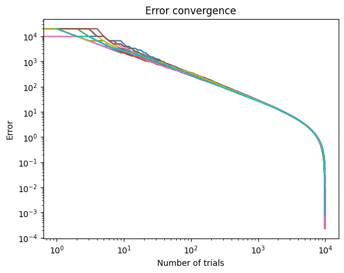
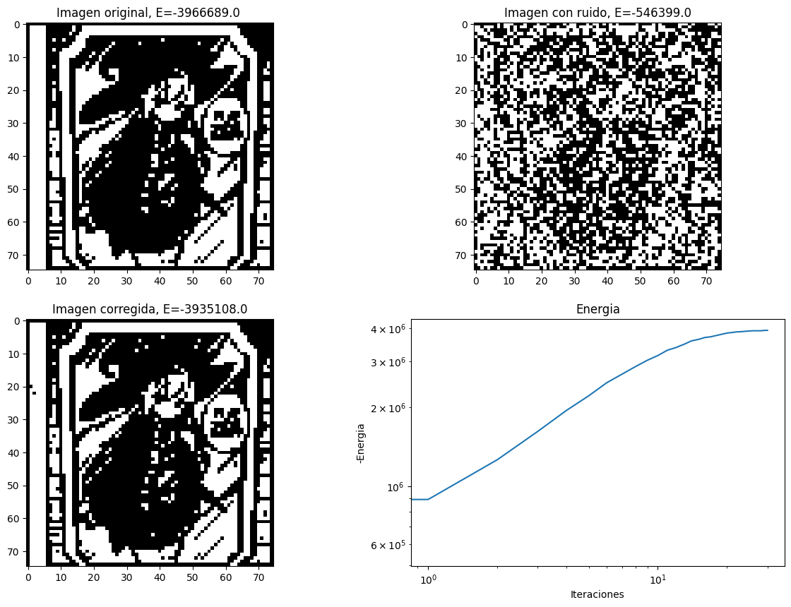
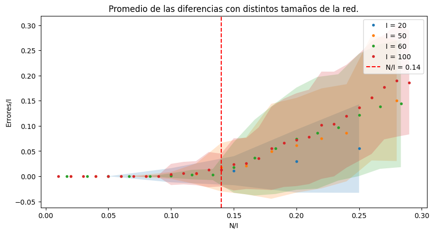

# Optimization-Algorithms

[](https://www.python.org/)
[](https://opensource.org/licenses/MIT)

Repositorio del trabajo *"Optimización en Sistemas Físicos y Aplicaciones Industriales"* realizado como parte del Máster Universitario en Tecnología Física: Investigación y Aplicaciones (2023-2024). Contiene implementaciones de algoritmos de optimización clásicos y métodos numéricos avanzados.


## Tabla de Contenidos
- [Descripción General](#descripción-general)
- [Estructura del Repositorio](#estructura-del-repositorio)
- [Temas Cubiertos](#temas-cubiertos)
  - [Tema 1: Problema del Viajante (TSP)](#tema-1-problema-del-viajante-tsp)
  - [Tema 2: Generadores Aleatorios y Métodos de Montecarlo](#tema-2-generadores-aleatorios-y-métodos-de-montecarlo)
  - [Tema 3: Algoritmos de Optimización (Simulated Annealing y Genético)](#tema-3-algoritmos-de-optimización-simulated-annealing-y-genético)
  - [Tema 4: Red Neuronal de Hopfield](#tema-4-red-neuronal-de-hopfield)
- [Instalación y Uso](#instalación-y-uso)
- [Resultados Clave](#resultados-clave)
- [Contribución](#contribución)
- [Licencia](#licencia)

---

## Descripción General
Este repositorio contiene implementaciones prácticas de algoritmos de optimización y métodos numéricos, desarrollados como parte de las actividades guiadas del máster. Los temas abarcan desde problemas clásicos como el TSP hasta técnicas avanzadas como redes neuronales de Hopfield.

---

## Estructura del Repositorio
```
Optimization-Algorithms/
├── 1 Introducción TSP/          # Soluciones exactas y aproximadas del TSP
├── 2 Números aleatorios/        # Generadores de números aleatorios y Aguja de Buffon
├── 3 Algoritmos de optimización/ # Simulated Annealing y Algoritmo Genético
├── 4 Clasificación de eventos/  # Red de Hopfield y análisis de capacidad
├── images/                      # Gráficos y figuras utilizadas
└── README.md                    # Este archivo
```

---

## Temas Cubiertos

### Tema 1: Problema del Viajante (TSP)
- **Objetivos**: Comparar métodos exactos (fuerza bruta) y aproximados (vecino más cercano).
- **Resultados**:
  - El método exacto es inviable para N > 10 (complejidad O(n!)).
  - El método aproximado escala con O(n²) y ofrece soluciones cercanas al óptimo.
  - Visualización de rutas y tiempos de ejecución:
  
    
  

- **Código**: [tsp.py](https://github.com/FullFran/Optimization-Algorithms/blob/main/1%20Introducción%20TSP/tsp.py) | [resultados.ipynb](https://github.com/FullFran/Optimization-Algorithms/blob/main/1%20Introducción%20TSP/resultados.ipynb)

---

### Tema 2: Generadores Aleatorios y Métodos de Montecarlo
- **Objetivos**: Implementar generadores de números aleatorios (GCL, Fibonacci) y métodos de Montecarlo (Aguja de Buffon).
- **Resultados**:
  - El generador de Fibonacci muestra mayor uniformidad que GCL.
  - Convergencia del error en Buffon sigue O(1/√N), validando métodos de Montecarlo.
  
    
  

- **Código**: [generadoresAleatorios.py](https://github.com/FullFran/Optimization-Algorithms/blob/main/2%20Números%20aleatorios%2C%20Métodos%20de%20Montecarlo/Generación%20de%20números%20Aleatorios/generadoresAleatorios.py) | [buffon_needle.ipynb](https://github.com/FullFran/Optimization-Algorithms/blob/main/2%20Números%20aleatorios%2C%20Métodos%20de%20Montecarlo/Aguja%20de%20Buffon/buffon_needle.ipynb)

---

### Tema 3: Algoritmos de Optimización (Simulated Annealing y Genético)
- **Objetivos**: Resolver TSP con métodos heurísticos.
- **Resultados**:
  - Simulated Annealing resuelve TSP para 90 ciudades en ~3.5s.
  - Algoritmo Genético muestra convergencia estable con elitismo.
  
    
  

- **Código**: [simAnnealing.py](https://github.com/FullFran/Optimization-Algorithms/blob/main/3%20Algoritmos%20para%20la%20optimización%20en%20espacios%20de%20alta%20dimensionalidad/simAnnealing.py) | [genetic.py](https://github.com/FullFran/Optimization-Algorithms/blob/main/3%20Algoritmos%20para%20la%20optimización%20en%20espacios%20de%20alta%20dimensionalidad/genetic.py)

---

### Tema 4: Red Neuronal de Hopfield
- **Objetivos**: Implementar memoria asociativa y analizar capacidad de almacenamiento.
- **Resultados**:
  - Recuperación de patrones desde entradas con ruido.
  - Límite de almacenamiento: ~0.14N (N = tamaño de la red).
  
    
  

- **Código**: [hopfield.py](https://github.com/FullFran/Optimization-Algorithms/blob/main/4%20Clasificación%20de%20eventos%20y%20detección%20de%20fallos/hopfiled.py) | [capacidad_red.ipynb](https://github.com/FullFran/Optimization-Algorithms/blob/main/4%20Clasificación%20de%20eventos%20y%20detección%20de%20fallos/capacidad_red.ipynb)

---

## Instalación y Uso
1. **Requisitos**:
   - Python 3.9+
   - Bibliotecas: `numpy`, `matplotlib`, `tqdm`
   ```bash
   pip install numpy matplotlib tqdm
   ```

2. **Ejecución**:
   - Los cuadernos Jupyter (.ipynb) contienen ejemplos detallados. Abrir con:
   ```bash
   jupyter notebook
   ```

---

## Resultados Clave
- **Optimización**: Los algoritmos heurísticos (Simulated Annealing y Genético) superan en escalabilidad a métodos exactos.
- **Montecarlo**: Validación empírica de órdenes de convergencia en métodos estocásticos.
- **Hopfield**: Demostración de memoria asociativa y límites teóricos de almacenamiento.


---

## Licencia
Este proyecto está bajo la licencia [MIT](https://opensource.org/licenses/MIT).

---

Desarrollado por [Francisco Manuel Olmedo Cortés](https://github.com/FullFran)  
*Máster en Tecnología Física: Investigación y Aplicaciones - 2023/2024*
